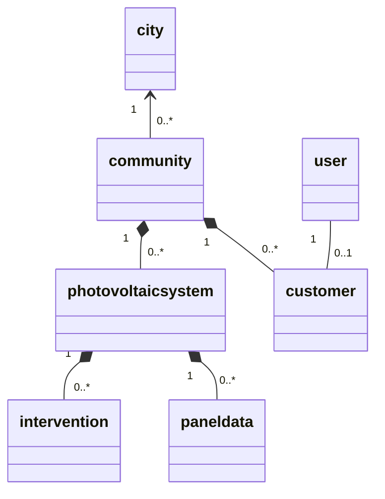

# SOLAR FAMILY

Solar Family aims to create an intelligent management system for residential photovoltaic communities.
The system optimizes self-consumption, monitors performance, and use collective intelligence to detect anomalies and improve efficiency.

## System Architecture

1. **IoT Layer (Arduino Node)**
   Each house is equipped with an Arduino-based monitoring node connected to:
   - Current Transformer sensors. One on the solar inverter output to measure production power. One on the main grid line to measure total house consumption.
   - Actuators. Smart relays to turn on/off appliances. We also have actuators that are part of an automated system for cleaning the photovoltaic panels.
2. **MQTT Communication Layer**
   MQTT acts as the messaging backbone between all the components.
   Each Arduino publishes its measurements to its own topic
   The Python Bridge and Django server subscribe to the topics
   The server can publish alerts or commands back to each node
3. **Python Bridge**
   The bridge acts as a go-between for the microcontroller and the server. It serves both as MQTT broker and HTTP client (building packets and sending them to the server and pull down commands).
4. **Django Backend**
   The **Django server** is the intelligence center of the system.
   It exposes REST APIs to receive and serve data, stores everything in a database, and provides an **interactive web UI** for visualization.
5. **Web Dashboard (Django UI)**
   Data can be visualized through charts, tables, and alerts, giving both individual users and administrators a clear understanding of the system status.

## Key Features

1. **Self-Consumption Optimization**
   The Arduino sensors measures both house consumption and PV production in real time.
   When the surplus energy (Production - Consumption) exceeds a configurable threshold for several minutes, the server sends an MQTT command to smart relays to turn on non-essential loads, such as water heater, electric car charging and softener regeneration. This allows us to maximize the local energy use, which is more profitable than selling excess energy to the grid.

2. **Environmental Impact Calculation**
   The system converts the community's total energy production into $CO_2$ savings, showing how much pollution has been avoided thanks to renewable energy

3. **Short-Term Production Forecasting**
   Using historical data and weather forecasting APIs, the system can estimate next-day energy production in $KWh$

4. **Dynamic Community Benchmark (Collective Intelligence)**
   Each home periodically reports its normalized yield (current power / peak installed power) via MQTT.
   The server aggregates all reports to calculate the real-time community benchmark - an objective reference for comparison.
   If a single system performs significantly below the community average, an alert is triggered (possible panel malfunction).
   If the whole community yield is inconsistent with the expected solar conditions from the weather API, the system triggers the actuators for a collective panel cleaning
5. **Energy Community Simulation**
   Each home reports its energy balance (surplus or deficit) via MQTT.
   The server computes the amount of energy that can be shared locally before importing from or exporting to the public grid, simulating the community's ability to be self-sustaining

## Implementation status

| Component / feature | Status |
|---|---|
| Sensor node (temperature, light, estimated power) and Python bridge | Implemented (the bridge sends data over HTTP; MQTT is not used yet) |
| REST API for the measurements (token for the bridge, per-community read access) | Implemented |
| Web dashboards for communities and single systems, with weather and map | Implemented |
| 3. Short-term production forecasting | Implemented (Random Forest, see [Forecast model](#forecast-model)) |
| 4. Community benchmark: public page with the measured yield per installed kW of every Italian city | Implemented (anomaly alerts not yet) |
| ROI calculator with printable quote, for staff consultants | Implemented |
| Actuators, 1. self-consumption optimization, 2. CO₂ savings, 5. energy community simulation | Not implemented yet |

## Project structure

```
ArduinoBridge/            Arduino sketches, SimulIDE circuit and the Python bridge (serial -> REST API)
backend/src/
  config/                 Django settings and root URLs
  SP/                     Core app
    models.py             City, Community, Customer, PhotovoltaicSystem, PanelData, Intervention
    production.py         Minute-by-minute production series and energy (kWh)
    benchmark.py          Measured yield per installed kW of every city
    weather.py            Daily weather from Open-Meteo (forecast and historical archive)
    api.py                REST API used by the bridge
    views.py              Registration, city benchmark and production dashboards
    management/commands/  import_cities, populate_db, create_bridge_user
    tests/                Tests of the SP app
  forecast/               Production forecast
    predictor.py          Features, model loading, community forecast and past-year yield of a city
    reference_data.py     Reference dataset (Open-Meteo weather + PVGIS production)
    training.py           Model, validation on unseen locations and training
    views.py              Forecast page (today / tomorrow)
    management/commands/  train_forecast_model
    data/                 Reference dataset (.csv.gz)
    ml_models/            Trained models (.joblib)
  roi/                    ROI calculator and printable quote (staff only)
    calculator.py         Yearly cash flows, payback and ROI
  templates/              Base layout and home page
```

## Getting started

The backend runs in Docker (`backend/src` is mounted in the container, so code changes reload the server):

```bash
docker compose up -d --build
docker exec iot_django_server python manage.py migrate
docker exec iot_django_server python manage.py import_cities       # Italian municipalities with coordinates
docker exec iot_django_server python manage.py populate_db         # fictitious communities, users and data
docker exec iot_django_server python manage.py createsuperuser
```

The web app is at http://localhost:8000. `populate_db` creates the customers `user0` ... `user14` and the staff
account `consulente` (for the ROI calculator), all with password `password123`; each day of fictitious production
follows the forecast model with the real weather of the community's city.

The trained forecast model is in the repository. To train it again (for example after changing the features):

```bash
docker exec iot_django_server python manage.py train_forecast_model                  # uses forecast/data/reference_dataset.csv.gz
docker exec iot_django_server python manage.py train_forecast_model --refresh-data   # downloads the dataset again (a few minutes)
```

To send real measurements, create the bridge user and pass its token to the bridge through the environment:

```bash
docker exec iot_django_server python manage.py create_bridge_user
pip install -r ArduinoBridge/requirements.txt
SOLAR_BRIDGE_TOKEN=<token> python ArduinoBridge/SensorsBridge.py
```

## Tests

```bash
docker exec iot_django_server python manage.py test
```

The tests use a separate database and do not call Open-Meteo.

## Forecast model

The model predicts the daily energy produced per installed kW (kWh/kWp) from the weather of the day and the
position of the sun (latitude and solar declination). Multiplied by the installed power it gives the production of
a system or of a whole community; summed over the real weather of the last 365 days it gives the annual production
used by the ROI calculator.

- **Algorithm**: Random Forest (scikit-learn), 100 trees with at least 50 days per leaf.
- **Training data**: 24 locations from Aosta to Catania, 2021–2023 (26,280 days). Features: daily weather from the
  Open-Meteo historical archive. Target: production of a 1 kWp system computed by
  [PVGIS](https://joint-research-centre.ec.europa.eu/photovoltaic-geographical-information-system-pvgis_en)
  (European Commission, JRC) from satellite irradiance, for an optimally oriented system with 14% system losses.
- **Validation** on locations excluded from training: mean daily error 0.48 kWh/kWp, annual production error 2.1%
  on average (7.8% at most).

The previous model was trained on the fictitious data of `populate_db`, whose production does not depend on the
weather: it predicted 5.76 kWh/kWp every day of the year in every city (about 2,100 kWh/kWp per year, 33–55% more
than PVGIS, with no seasons). The measurements of the communities can be added to the training once they cover at
least a full year.

# Possibili implementazioni

## 4. **Dynamic Community Benchmark (Collective Intelligence)**

### Su Arduino (per ogni casa)

- **Misurazione:** Leggere la potenza istantanea ($W$) prodotta.
- **Invio Dati (MQTT Publish):** Pubblicare su un topic MQTT (es. `comunita/casa_A/produzione`) un payload JSON : `{ "potenza_w": 1500}`.
- **Ricezione Alert (MQTT Subscribe):** Sottoscriversi a un topic di alert (es. `comunita/casa_A/alert`) per ricevere messaggi dal server (es. "Pulisci pannelli").

### Su Python Bridge (MQTT <-> HTTP)

- **Ascolto (Subscribe):** Sottoscriversi al topic "wildcard" di produzione: `comunita/+/produzione`.
- **Inoltro (HTTP POST):** Quando riceve un messaggio, estrarre l'ID della casa (es. `casa_A`) dal topic e inoltrare il payload JSON all'endpoint API di Django (es. `POST /api/produzione/`).

### Su Server Django (Backend)

- **Modelli (Database):**
  - `Impianto`: Per salvare i dati statici (es. `nome="casa_A"`, `potenza_picco_wp=3000`).
  - `DatoProduzione`: Per salvare i dati in ingresso (Timestamp, `potenza_w`, `impianto [FK]`).
- **API (Ricezione):** Creare l'endpoint `POST /api/produzione/` che riceve i dati dal Bridge e li salva nel database.
- **Logica di Business (Task periodica, es. ogni 5 min):**
  1. Recuperare gli ultimi dati validi (es. ultimo minuto) di _tutti_ gli impianti.
  2. Calcolare il rendimento (`potenza_w / potenza_picco_wp`)di ogni casa
  3. Calcolare il \*\*`rendimento_medio_comunita
  4. Ciclare su ogni impianto: se `rendimento_singolo < (rendimento_medio_comunita * 0.85)` (cioè performa il 15% in meno della media), marcare l'impianto come "anomalo".
  5. **Azione:** Se un impianto è "anomalo", pubblicare un messaggio sul suo topic MQTT (es. `comunita/casa_A/alert` con payload `"performance_bassa"`) e salvarlo nel DB.
- **API (Esposizione):** Creare un endpoint `GET /api/dashboard/` che mostri lo stato di ogni impianto e il benchmark della comunità.

## 5. Simulazione di una Comunità Energetica

### Su Arduino (per ogni casa)

- **Misurazione:** Leggere la potenza istantanea prodotta e i consumi totali della casa
- **Invio Dati (MQTT Publish):** Modificare il payload MQTT (es. sul topic `comunita/casa_A/bilancio`) per includere i consumi: `{ "produzione_w": 1500, "consumo_w": 400 }`.

### Su Python Bridge

- **Ascolto (Subscribe):** Sottoscriversi al nuovo topic `comunita/+/bilancio`.
- **Inoltro (HTTP POST):** Inoltrare il nuovo payload (produzione + consumo) a un endpoint API dedicato (es. `POST /api/bilancio/`).

### Su Server Django

- **Modelli (Database):** Aggiornare il modello `DatoProduzione` per includere il campo `consumo_w`.
- **API (Ricezione):** Creare l'endpoint `POST /api/bilancio/` per salvare i dati.
- **Logica di Business (Endpoint di calcolo):** Creare un endpoint `GET /api/comunita/stato/` che, quando chiamato:
  1. Recupera gli ultimi dati di bilancio di tutte le case.
  2. Calcola il `bilancio_casa` per ognuna (es. `produzione - consumo`).
  3. Calcola il `bilancio_totale_comunità` (somma di tutti i bilanci).
  4. **Logica di Simulazione:** Calcola quanta energia è "autoconsumata" dalla comunità (l'energia prodotta dai surplus che copre i deficit) e quanta è prelevata dalla rete esterna.
- **Dashboard:** Creare una pagina web che chiami questa API e mostri graficamente i flussi energetici (es. Casa A dà 500W a Casa C; la comunità preleva 1200W dalla rete).

# Diagramma ER


