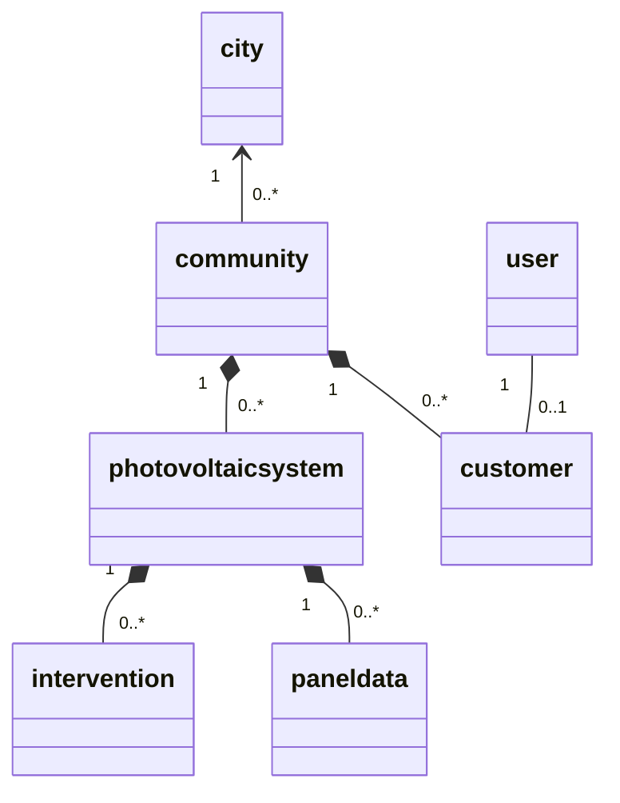

# SOLAR FAMILY

Solar Family aims to create an intelligent management system for residential photovoltaic communities.
The system optimizes self-consumption, monitors performance, and use collective intelligence to detect anomalies and improve efficiency.

## System Architecture

1. **IoT Layer (Arduino Node)**
   Each house is equipped with an Arduino-based monitoring node connected to:
   - Current Transformer sensors. One on the solar inverter output to measure production power. One on the main grid line to measure total house consumption.
   - Actuators. Smart relays to turn on/off appliances. We also have actuators that are part of an automated system for cleaning the photovoltaic panels.
2. **MQTT Communication Layer**
   MQTT acts as the messaging backbone between all the components: a Mosquitto broker routes the messages.
   The bridge of each system publishes its measurements to the topics of its system and the Django server
   subscribes to them; the server publishes the status of each system back to its bridge (see [MQTT](#mqtt)).
3. **Python Bridge**
   The bridge acts as a go-between for the microcontroller and the broker: it reads the Arduino on the serial
   port (UART), publishes the measurements and forwards the status of the system to the Arduino.
4. **Django Backend**
   The **Django server** is the intelligence center of the system.
   It exposes REST APIs to receive and serve data, stores everything in a database, and provides an **interactive web UI** for visualization.
5. **Web Dashboard (Django UI)**
   Data can be visualized through charts, tables, and alerts, giving both individual users and administrators a clear understanding of the system status.

## Key Features

1. **Self-Consumption Optimization**
   The Arduino sensors measures both house consumption and PV production in real time.
   When the surplus energy (Production - Consumption) exceeds a configurable threshold for several minutes, the server sends an MQTT command to smart relays to turn on non-essential loads, such as water heater, electric car charging and softener regeneration. This allows us to maximize the local energy use, which is more profitable than selling excess energy to the grid.

2. **Environmental Impact Calculation**
   The system converts the community's total energy production into $CO_2$ savings, showing how much pollution has been avoided thanks to renewable energy

3. **Short-Term Production Forecasting**
   Using historical data and weather forecasting APIs, the system can estimate next-day energy production in $KWh$

4. **Dynamic Community Benchmark (Collective Intelligence)**
   Each home periodically reports its normalized yield (current power / peak installed power) via MQTT.
   The server aggregates all reports to calculate the real-time community benchmark - an objective reference for comparison.
   If a single system performs significantly below the community average, an alert is triggered (possible panel malfunction).
   If the whole community yield is inconsistent with the expected solar conditions from the weather API, the system triggers the actuators for a collective panel cleaning
5. **Energy Community Simulation**
   Each home reports its energy balance (surplus or deficit) via MQTT.
   The server computes the amount of energy that can be shared locally before importing from or exporting to the public grid, simulating the community's ability to be self-sustaining

## Implementation status

| Component / feature | Status |
|---|---|
| Sensor node (temperature, light, estimated power), water pump for cleaning the panels and Python bridge | Implemented, over MQTT (see [MQTT](#mqtt)) |
| Installation of the devices on the systems, for the staff (and to test the bridge as any system) | Implemented (see [Devices and installations](#devices-and-installations)) |
| REST API to read the measurements (per-community read access) | Implemented |
| Web dashboards for communities and single systems, with weather and map; after login, a dashboard with the status of each system | Implemented |
| 3. Short-term production forecasting | Implemented (Random Forest, see [Forecast model](#forecast-model)) |
| 4. Community benchmark: public page with the measured yield per installed kW of every Italian city and a heatmap of Italy (measured yield, or PVGIS expected yield) | Implemented, with the automatic check of each system (see [System monitoring](#system-monitoring)) |
| ROI calculator with printable quote, for staff consultants | Implemented |
| Maintenance interventions: requests of the customers, staff dashboard and printable report | Implemented (see [Maintenance interventions](#maintenance-interventions)) |
| Smart relays of the appliances, 1. self-consumption optimization, 2. CO₂ savings, 5. energy community simulation | Not implemented yet |

## Project structure

```
ArduinoBridge/            Arduino sketch, SimulIDE circuit and the Python bridge (serial <-> MQTT)
  SolarNode/              Sketch: sensors, water pump and status LEDs
  bridge.py               Bridge of one system: serial port (or simulated Arduino) <-> MQTT broker
  protocol.py             Serial protocol between Arduino and bridge
  serial_ports.py         Serial ports of Windows, macOS and Linux: finds the one where the Arduino answers
  simulated_node.py       Simulated Arduino, to test without SimulIDE
mosquitto/                Configuration of the MQTT broker
backend/src/
  config/                 Django settings and root URLs
  SP/                     Core app
    models.py             City, Community, Customer, PhotovoltaicSystem, PanelData, Intervention
    production.py         Minute-by-minute production series and energy (kWh)
    benchmark.py          Measured yield per installed kW of every city, expected yield of the reference locations
    monitoring.py         Check of each system: production compared with the forecast and with nearby systems
    interventions.py      Maintenance interventions: request, staff dashboard, acceptance, execution, report
    mqtt.py               MQTT topics and messages: readings received, status and configuration published
    mqtt_auth.py          Who can connect to the broker and to which topics (asked by the broker)
    installations.py      Installation of the devices on the systems (staff)
    access.py             Who can see which systems, staff-only pages
    weather.py            Daily weather from Open-Meteo (forecast and historical archive)
    api.py                REST API to read the measurements
    views.py              Registration, city benchmark and production dashboards
    management/commands/  import_cities, populate_db, check_systems, mqtt_worker, device_credentials
    tests/                Tests of the SP app
  forecast/               Production forecast
    predictor.py          Features, model loading, community forecast and past-year yield of a city
    reference_data.py     Reference dataset (Open-Meteo weather + PVGIS production)
    training.py           Model, validation on unseen locations and training
    views.py              Forecast page (today / tomorrow)
    management/commands/  train_forecast_model
    data/                 Reference dataset (.csv.gz)
    ml_models/            Trained models (.joblib)
  roi/                    ROI calculator and printable quote (staff only)
    calculator.py         Yearly cash flows, payback and ROI
  templates/              Base layout and home page
```

## Getting started

The backend runs in Docker (`backend/src` is mounted in the container, so code changes reload the server):

```bash
docker compose up -d --build
docker exec iot_django_server python manage.py migrate
docker exec iot_django_server python manage.py import_cities       # Italian municipalities with coordinates
docker exec iot_django_server python manage.py populate_db         # realistic demo communities, users and readings
docker exec iot_django_server python manage.py createsuperuser
```

The web app is at http://localhost:8000. A community is a company: it owns the photovoltaic systems and its
users access it with their own accounts (each user belongs to exactly one community). Every community has one
owner, one of its users: the first user of a community becomes its owner, and another one can be chosen from the
admin; the owner can only be deleted together with the community.

`populate_db` replaces communities, users, systems and readings with demo data: by default a company in 2–3 cities
of every region (about 50), named after its owner (like "Rossi Trasporti"), with 2–4 users and 3–8 systems (the
headquarters, warehouses, offices, shops, ...), and one reading per minute for the last 7 days: about 250 systems
and 2.5 million readings, generated in about 20 seconds. The users log in as `user0`, `user1`, ...; the staff
accounts `consulente` (for the ROI calculator) and the technicians `tecnico1` and `tecnico2` have the same password,
`password123`. After checking the systems it creates intervention requests for most of the probable faults (some
already accepted) and 25 interventions executed in the last months.

The readings are realistic: every day each system produces what the forecast model predicts with the real weather
of its city (Open-Meteo), scaled by the orientation of the system (up to 7% less). About 5% of the systems have a
fault (20–50% less), and in about 15% of the cities the dust makes all the systems produce 14–22% less: the
monitoring finds them as probable faults and dirty panels. During the day the power follows the height of the sun, the clouds of that day (shared by the systems of a
city) and the cell temperature; light and air temperature follow the same sun and the day's minimum and maximum.
Options: `--days` (up to 90), `--cities_per_region`, `--users_per_community` and `--systems_per_community`
(a number or a range like `2-3`), `--seed` to generate the same data again.

The trained forecast model is in the repository. To train it again (for example after changing the features):

```bash
docker exec iot_django_server python manage.py train_forecast_model                  # uses forecast/data/reference_dataset.csv.gz
docker exec iot_django_server python manage.py train_forecast_model --refresh-data   # downloads the dataset again (a few minutes)
```

To connect a bridge, install a device on a system (page **Installazioni** of the staff, or the command below,
which works for any system, also those of the demo data) and start the bridge with its credentials:

```bash
docker exec iot_django_server python manage.py device_credentials 42      # prints username (pv-42) and token
pip install -r ArduinoBridge/requirements.txt
python ArduinoBridge/bridge.py --device pv-42 --token <token>              # Arduino (SimulIDE or USB)
python ArduinoBridge/bridge.py --device pv-42 --token <token> --simulate   # simulated Arduino
```

With the Arduino the bridge finds the serial port by itself (see [Serial ports](#serial-ports) and
[Connecting the Arduino](#connecting-the-arduino)); `--serial COM2`
or `--serial /dev/cu.usbmodem1101` chooses it explicitly.

The token can also be passed with the environment variable `SOLAR_DEVICE_TOKEN`. See [MQTT](#mqtt).

## System monitoring

Every 2 days each system is checked on the last 2 complete days (`SP/monitoring.py`):

1. Its production is compared with what the forecast model predicts with the real weather of those days: if it is
   more than 10% lower, the system has an anomaly.
2. Only then it is compared with up to 10 nearby systems: those of the communities of the same city (first the ones
   of its own community) or, if there are none with readings, those of the nearest city that has some. If at least
   half of them also have an anomaly the cause is shared by the area and the panels are just **dirty**; otherwise
   the system has a **probable fault**.

The result (`OK`, `Pannelli sporchi`, `Probabile guasto`) and the date of the check are saved in the system and shown
on its page. Days with less than 90% of the readings are not compared: the system is checked again at the next run.

The `scheduler` service of docker compose runs `check_systems` every hour, and the command checks only the systems
not checked in the last 2 days, so each system is checked every 2 days even after a restart. `populate_db` runs it
at the end. To run it by hand:

```bash
docker exec iot_django_server python manage.py check_systems                   # systems due for a check
docker exec iot_django_server python manage.py check_systems --all --community 3   # every system of community 3
```

## MQTT

docker compose runs the broker (`mosquitto`, port 1883 open for the bridges on the PC) and the `mqtt-worker`
service (`python manage.py mqtt_worker`), which receives the messages of the devices and saves them. Every system
has its topics under `solarfamily/systems/<id>/`:

| Topic | From → to | Retained | Content |
|---|---|---|---|
| `telemetry` | bridge → server | no | average of one minute: `{"time_stamp": "2026-10-06T10:41:00+00:00", "temperature": 21.5, "lightness": 812.0, "power": 3.42, "samples": 40}` (power in kW, time in UTC) |
| `connection` | bridge → server | yes | `online` when the bridge connects; `offline` when it closes or, as Last Will, published by the broker when it disappears |
| `events` | bridge → server | no | water pump: `{"event": "pump_on"}`, `{"event": "pump_off"}` |
| `status` | server → bridge | yes | `{"status": "DRT", "label": "Pannelli sporchi", "previous": "OK", "changed_at": "...", "checked_at": "..."}` |
| `config` | server → bridge | yes | `{"system_id": 42, "name": "Sede", "max_power_kw": 14.62, "community": "...", "city": "...", "owner": "..."}` |

All the messages use QoS 1: they are repeated until the broker confirms them, so a reading can arrive twice and
the second one is discarded (a system has one reading per minute). Status and configuration are retained: the
broker keeps the last ones and sends them to the bridge as soon as it subscribes, so the bridge knows the maximum
power of its system and its current status even after a restart. The worker publishes them again for every
installed system when it connects; `check_systems` publishes the status when it changes, the staff pages and the
admin when a device is installed or a system is modified.

**Access.** Nobody can connect anonymously. The broker uses the plugin
[mosquitto-go-auth](https://github.com/iegomez/mosquitto-go-auth) and asks Django (`/sp/mqtt/auth/...`) at every
connection, publication and subscription:

- the server connects as `solarfamily-server` with the password `MQTT_SERVER_PASSWORD` (`solarfamily-dev` by
  default, set another one in a `.env` file next to `docker-compose.yml`) and can access every topic;
- a device connects as `pv-<id of the system>` with its token and its username as client id. It can publish only
  `telemetry`, `connection` and `events` of its system and receive only its `status` and `config`. New
  credentials or uninstalling the device stop the old token at once.

**Bridge and Arduino.** The bridge averages the readings of the Arduino over each minute and publishes them; it
sends to the Arduino the maximum power of the system (`CFG|14620`, in W) and its status (`STATUS|DRT|1`). The
Arduino sends no reading until it has the maximum power. When the status becomes **DRT** (dirty panels) it runs
the water pump for 10 seconds, only once per change: the bridge remembers in `ArduinoBridge/.state/` the last change
it forwarded. The serial protocol is described in `ArduinoBridge/protocol.py`; the pins of pump and LEDs in
`ArduinoBridge/SolarNode/SolarNode.ino`.

### Serial ports

The serial link is the same on every system (UART, 9600 baud, 8N1, lines of text); only the name of the port
changes:

| | Arduino on USB | SimulIDE |
|---|---|---|
| Windows | `COM3`, `COM4`, ... (number given by Windows, see Device Manager) | virtual pair of [com0com](https://com0com.sourceforge.net/): SimulIDE on `COM1`, bridge on `COM2` |
| macOS | `/dev/cu.usbmodem…` (original boards), `/dev/cu.usbserial-…` or `/dev/cu.wchusbserial…` (clones with CH340) | virtual pair of socat (below): SimulIDE on `/tmp/solarnode-simulide`, bridge on `/tmp/solarnode-bridge` |
| Linux | `/dev/ttyACM0` (original boards), `/dev/ttyUSB0` (clones) | virtual pair of socat, as on macOS |

On macOS every port appears twice: `/dev/tty.*` waits for a carrier signal that the Arduino never sends, so the
bridge uses `/dev/cu.*`. A COM port of Windows can be opened by one program at a time; on macOS and Linux the
bridge locks the port, so that two programs do not steal each other's data.

**Identity check.** With `--serial auto` (the default) the bridge opens only the ports that can be an Arduino:
USB boards (original Arduino first) and virtual pairs. Bluetooth and system ports are never opened. On each one it
sends `ID` and waits up to 3 seconds for `ID|SolarNode|1` (device type and protocol version), sending it again
every half second because a USB board restarts when its port is opened. It keeps the first port that answers so
(without closing it, which would restart the board again) and explains why the others were discarded: busy,
silent, another device, an old sketch or another protocol version. An explicit `--serial` port is checked the
same way. To see the ports and who answers on each:

```bash
python ArduinoBridge/bridge.py --list-ports
```

### Connecting the Arduino

The Arduino of the project runs in SimulIDE; a real board on USB works the same way (see the end of each procedure).

**First, on every system**

1. Start the server: `docker compose up -d --build` (the first time also `migrate`, see [Getting started](#getting-started)).
2. Compile the sketch with Arduino IDE 2: install the library *DHT sensor library* by Adafruit (with its
   dependencies), open `ArduinoBridge/SolarNode/SolarNode.ino`, choose *Arduino Uno* and use
   *Sketch → Export Compiled Binary*. The file to use is `ArduinoBridge/SolarNode/build/arduino.avr.uno/SolarNode.ino.hex`
   (not the one `with_bootloader`); the `build` folder is ignored by git.
3. In SimulIDE open `ArduinoBridge/SensorsArchitecture.sim1`, right-click the Arduino → *Load firmware* → the
   `.hex` above, and save the circuit. Optionally add the pump and the status LEDs, each with a 220 Ω resistor to
   GND: pump (a LED) on D7, green on D8, yellow on D9, red on D10. The circuit has a thermistor on A4 while the
   sketch reads a DHT11 on D4: until they match, the temperature is always 25 °C.
4. Get the credentials of the device: page **Installazioni** → system → *Installa dispositivo* (or *Nuove
   credenziali*), or `docker exec iot_django_server python manage.py device_credentials <id>`.

**Windows**

1. Install [com0com](https://sourceforge.net/projects/com0com/files/com0com/2.2.2.0/), the **signed** version
   `com0com-2.2.2.0-x64-fre-signed.zip` (64-bit Windows blocks unsigned drivers), as administrator.
2. Create the pair COM1–COM2: open *Setup for com0com* from the Start menu, rename `CNCA0` to `COM1` and `CNCB0`
   to `COM2`, *Apply* (or, in an administrator prompt in the com0com folder, `setupc change CNCA0 PortName=COM1`
   and `setupc change CNCB0 PortName=COM2`). Check them in *Device Manager → Ports (COM & LPT)*; if COM1 or COM2
   are taken, use two free numbers: SimulIDE uses the first one, the bridge finds the second by itself.
3. In SimulIDE set the *SerialPort* component to Port `COM1`, 9600 baud, 8 data bits, 1 stop bit; start the
   simulation and open the port from the component.
4. Start the bridge from the folder of the project (`py` instead of `python` if needed):

   ```powershell
   python -m venv ArduinoBridge\.venv
   ArduinoBridge\.venv\Scripts\python -m pip install -r ArduinoBridge\requirements.txt
   ArduinoBridge\.venv\Scripts\python ArduinoBridge\bridge.py --list-ports
   ArduinoBridge\.venv\Scripts\python ArduinoBridge\bridge.py --device pv-42 --token <token>
   ```

   `--list-ports` should show `COM1: occupata da un altro programma` (SimulIDE keeps it) and
   `COM2: SolarNode, protocollo 1`. The bridge then logs `Arduino SolarNode sulla porta COM2` and
   `Arduino configurato: CFG|…`, and the page **Installazioni** shows the device as connected.

With a real board: original boards install their driver by themselves, clones with the CH340 chip need the
CH341SER driver of WCH; the board appears as `COMx` in Device Manager. Upload the sketch from Arduino IDE, **close
the Serial Monitor** (it keeps the port busy) and start the bridge without `--serial`.

**macOS**

1. Install SimulIDE (*macOS X86* from [simulide.com](https://simulide.com/p/download110/)): on Apple Silicon it
   runs with Rosetta 2, which macOS offers to install. The app is not signed: open it the first time with
   right-click → *Open* (or *System Settings → Privacy & Security → Open Anyway*).
2. Install socat, which creates the virtual pair (there is no com0com on macOS), and leave it running in its own
   terminal:

   ```bash
   brew install socat
   socat -d -d pty,raw,echo=0,link=/tmp/solarnode-simulide pty,raw,echo=0,link=/tmp/solarnode-bridge
   ```

3. In SimulIDE set the *SerialPort* component to Port `/tmp/solarnode-simulide` (the whole path), 9600 baud; start
   the simulation and open the port.
4. Start the bridge in another terminal:

   ```bash
   python3 -m venv ArduinoBridge/.venv
   ArduinoBridge/.venv/bin/pip install -r ArduinoBridge/requirements.txt
   ArduinoBridge/.venv/bin/python ArduinoBridge/bridge.py --list-ports
   ArduinoBridge/.venv/bin/python ArduinoBridge/bridge.py --device pv-42 --token <token>
   ```

   `--list-ports` should show `/tmp/solarnode-bridge (porta virtuale…): SolarNode, protocollo 1`; the Bluetooth
   ports are not queried.
5. Start them in this order: socat, SimulIDE, bridge. Restarting socat changes the virtual ports, so the port must
   be opened again in SimulIDE. The bridge can be closed and started again; if socat closes together with it,
   start socat again and reopen the port in SimulIDE.

With a real board: usually no driver is needed; an original board appears as `/dev/cu.usbmodem…`, a CH340 clone
as `/dev/cu.usbserial-…` (the same ports also appear as `/dev/tty.*`: the bridge uses `cu`). Upload the sketch,
**close the Serial Monitor** and start the bridge without `--serial`.

**If something goes wrong**, `--list-ports` tells what it finds on each port:

| Message | What to do |
|---|---|
| no port that can be an Arduino | Windows: com0com is not installed or not recognized, try `--serial COM2`; macOS: socat is not running |
| nessuna risposta | the simulation is not running, the port is not open in SimulIDE or SimulIDE uses another port |
| non è un SolarNode aggiornato | SimulIDE still has the old `.hex`: load `SolarNode.ino.hex` |
| occupata da un altro programma | another bridge or the Serial Monitor is open (on Windows it is normal for COM1, kept by SimulIDE) |

## Devices and installations

The page **Installazioni** of the staff (`/sp/installations/`) lists the systems with the state of their device
(not installed, connected, disconnected, last message, last cleaning). From there the staff can:

- **create a new system** of a community with its device, as a technician installing it would do;
- **install a device** on an existing system (for example to test the bridge as a system of the demo data),
  **generate new credentials** (the old token stops working) or **uninstall** it;
- **set the status** of the system, saved as if the automatic check had found it and sent to the device: with
  *Pannelli sporchi* the Arduino runs the pump. Every status set is a new change, so the cleaning can be tested
  again.

The token is shown once, with the command to start the bridge; only its hash is saved. `populate_db` deletes the
systems and so their devices.

To test the bridge without a broker or serial port:

```bash
cd ArduinoBridge && python -m unittest discover -s tests -t .
```

## Maintenance interventions

When the check finds a probable fault, the page of the system shows the **Richiedi intervento** button to the users
of its community: it opens a calendar to choose the day of the intervention (from tomorrow to two months ahead). A
system can have one open request at a time; after an intervention a new one can be requested only if a later check
finds the fault again. The users see the status of the requests on the page of the system:

1. **Richiesta inoltrata**: the request waits for the staff;
2. **Richiesta accettata**: a staff member chose the kind of intervention and accepted the request, taking charge of
   it. Only that staff member can record the execution;
3. **Intervento eseguito**: the date of execution, the work done and the cost are recorded.

The staff dashboard (`/sp/interventions/`, menu **Interventi**, with the number of requests to accept) shows the
requests to accept, the interventions in progress and the executed ones, with the requests whose day has passed.
Every intervention has a printable report (or saved as PDF from the browser), available to the staff and to the
users of the community.

## Tests

```bash
docker exec iot_django_server python manage.py test
```

The tests use a separate database and do not call Open-Meteo.

## Forecast model

The model predicts the daily energy produced per installed kW (kWh/kWp) from the weather of the day and the
position of the sun (latitude and solar declination). Multiplied by the installed power it gives the production of
a system or of a whole community; summed over the real weather of the last 365 days it gives the annual production
used by the ROI calculator.

- **Algorithm**: Random Forest (scikit-learn), 100 trees with at least 50 days per leaf.
- **Training data**: 24 locations from Aosta to Catania, 2021–2023 (26,280 days). Features: daily weather from the
  Open-Meteo historical archive. Target: production of a 1 kWp system computed by
  [PVGIS](https://joint-research-centre.ec.europa.eu/photovoltaic-geographical-information-system-pvgis_en)
  (European Commission, JRC) from satellite irradiance, for an optimally oriented system with 14% system losses.
- **Validation** on locations excluded from training: mean daily error 0.48 kWh/kWp, annual production error 2.1%
  on average (7.8% at most).

The previous model was trained on the fictitious data of `populate_db`, whose production does not depend on the
weather: it predicted 5.76 kWh/kWp every day of the year in every city (about 2,100 kWh/kWp per year, 33–55% more
than PVGIS, with no seasons). The measurements of the communities can be added to the training once they cover at
least a full year.

# Possibili implementazioni

## 4. **Dynamic Community Benchmark (Collective Intelligence)**

### Su Arduino (per ogni casa)

- **Misurazione:** Leggere la potenza istantanea ($W$) prodotta.
- **Invio Dati (MQTT Publish):** Pubblicare su un topic MQTT (es. `comunita/casa_A/produzione`) un payload JSON : `{ "potenza_w": 1500}`.
- **Ricezione Alert (MQTT Subscribe):** Sottoscriversi a un topic di alert (es. `comunita/casa_A/alert`) per ricevere messaggi dal server (es. "Pulisci pannelli").

### Su Python Bridge (MQTT <-> HTTP)

- **Ascolto (Subscribe):** Sottoscriversi al topic "wildcard" di produzione: `comunita/+/produzione`.
- **Inoltro (HTTP POST):** Quando riceve un messaggio, estrarre l'ID della casa (es. `casa_A`) dal topic e inoltrare il payload JSON all'endpoint API di Django (es. `POST /api/produzione/`).

### Su Server Django (Backend)

- **Modelli (Database):**
  - `Impianto`: Per salvare i dati statici (es. `nome="casa_A"`, `potenza_picco_wp=3000`).
  - `DatoProduzione`: Per salvare i dati in ingresso (Timestamp, `potenza_w`, `impianto [FK]`).
- **API (Ricezione):** Creare l'endpoint `POST /api/produzione/` che riceve i dati dal Bridge e li salva nel database.
- **Logica di Business (Task periodica, es. ogni 5 min):**
  1. Recuperare gli ultimi dati validi (es. ultimo minuto) di _tutti_ gli impianti.
  2. Calcolare il rendimento (`potenza_w / potenza_picco_wp`)di ogni casa
  3. Calcolare il \*\*`rendimento_medio_comunita
  4. Ciclare su ogni impianto: se `rendimento_singolo < (rendimento_medio_comunita * 0.85)` (cioè performa il 15% in meno della media), marcare l'impianto come "anomalo".
  5. **Azione:** Se un impianto è "anomalo", pubblicare un messaggio sul suo topic MQTT (es. `comunita/casa_A/alert` con payload `"performance_bassa"`) e salvarlo nel DB.
- **API (Esposizione):** Creare un endpoint `GET /api/dashboard/` che mostri lo stato di ogni impianto e il benchmark della comunità.

## 5. Simulazione di una Comunità Energetica

### Su Arduino (per ogni casa)

- **Misurazione:** Leggere la potenza istantanea prodotta e i consumi totali della casa
- **Invio Dati (MQTT Publish):** Modificare il payload MQTT (es. sul topic `comunita/casa_A/bilancio`) per includere i consumi: `{ "produzione_w": 1500, "consumo_w": 400 }`.

### Su Python Bridge

- **Ascolto (Subscribe):** Sottoscriversi al nuovo topic `comunita/+/bilancio`.
- **Inoltro (HTTP POST):** Inoltrare il nuovo payload (produzione + consumo) a un endpoint API dedicato (es. `POST /api/bilancio/`).

### Su Server Django

- **Modelli (Database):** Aggiornare il modello `DatoProduzione` per includere il campo `consumo_w`.
- **API (Ricezione):** Creare l'endpoint `POST /api/bilancio/` per salvare i dati.
- **Logica di Business (Endpoint di calcolo):** Creare un endpoint `GET /api/comunita/stato/` che, quando chiamato:
  1. Recupera gli ultimi dati di bilancio di tutte le case.
  2. Calcola il `bilancio_casa` per ognuna (es. `produzione - consumo`).
  3. Calcola il `bilancio_totale_comunità` (somma di tutti i bilanci).
  4. **Logica di Simulazione:** Calcola quanta energia è "autoconsumata" dalla comunità (l'energia prodotta dai surplus che copre i deficit) e quanta è prelevata dalla rete esterna.
- **Dashboard:** Creare una pagina web che chiami questa API e mostri graficamente i flussi energetici (es. Casa A dà 500W a Casa C; la comunità preleva 1200W dalla rete).

# Diagramma ER


